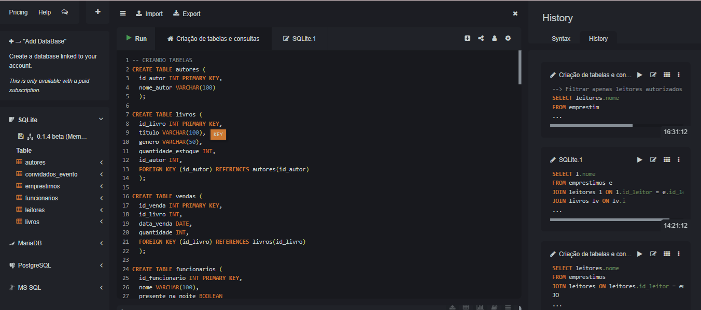
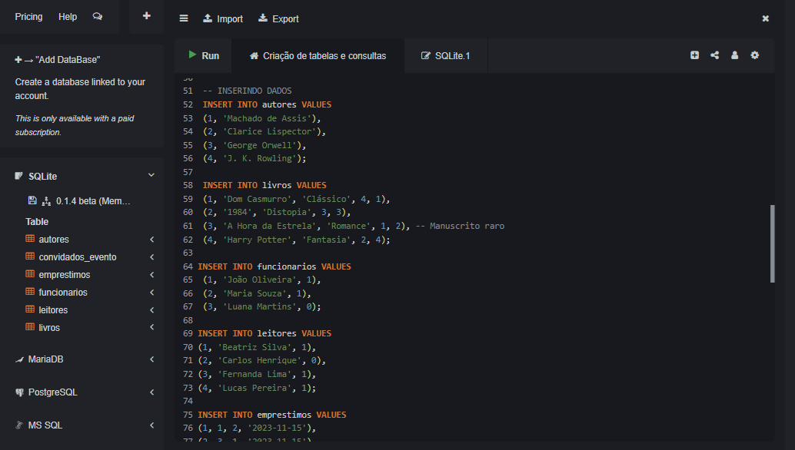
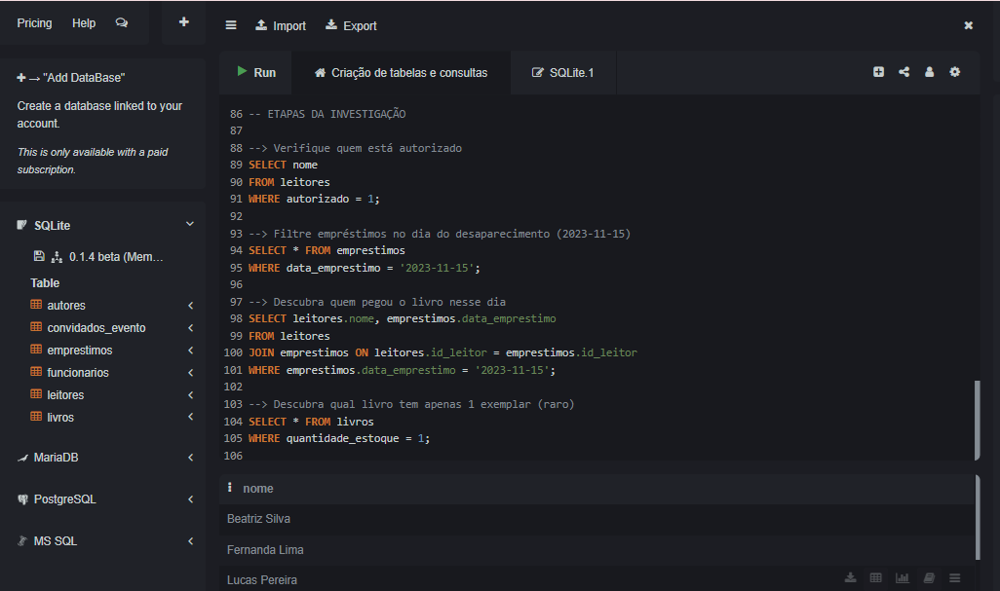
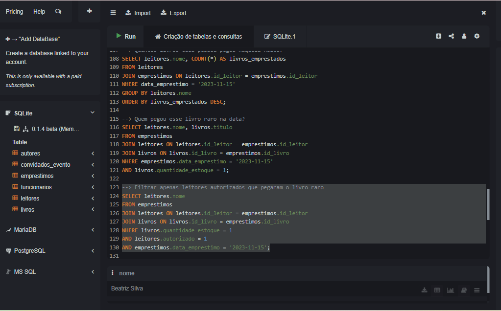

> 📚 Este projeto foi desenvolvido como exercício prático do **Bootcamp Data Girls Restart**.

## 🧩 SQL Mystery – O Caso do Manuscrito Perdido

Neste desafio de SQL, meu objetivo foi investigar o desaparecimento de um manuscrito raro na Biblioteca Central.
Apenas pessoas autorizadas tiveram acesso ao local naquela noite, e usando os registros de empréstimos, presença e convidados, busquei descobrir quem levou o manuscrito.

Usei consultas SQL para analisar os dados e encontrar o suspeito.

## 📁 Estrutura do Projeto

- `1_criacao_tabelas.sql`   ---> Criação das tabelas do banco
- `2_inserindo_dados.sql`   ---> Inserção dos dados no banco
- `3_consulta-misterio.sql` ---> Consultas que ajudam na investigação
- `imagens/`              ---> Prints da execução no ambiente SQLiteOnline

## 🧩 Objetivo

O objetivo é **exercitar habilidades de SQL** por meio de uma narrativa investigativa, utilizando comandos como:

- `CREATE TABLE`
- `INSERT INTO`
- `SELECT`, `WHERE`, `JOIN`, `GROUP BY`, etc.

## 🖼️ Execução no SQLiteOnline

### Criação das Tabelas

### Inserção de Dados

### Etapas da Investigação

### Resultado Final: A Pessoa Suspeita

## ✅ Solução Final

Apesar de várias pessoas terem feito empréstimos naquela noite, apenas **Beatriz Silva** pegou o livro **A Hora da Estrela**, que era o único exemplar e o possível manuscrito raro. Ela também pegou outro livro (1984), o que levanta ainda mais suspeitas...

## ✅ Conclusão

Ao final da investigação, identificamos que **Beatriz** provavelmente foi a pessoa que ficou com o manuscrito raro.

---

Projeto desenvolvido por mim, participante do Bootcamp 
🎓 Exercício realizado durante o bootcamp Data Girls Restart
